# Deployment Guide for Services

> This repository presents a solution and reference architecture for the comparative analysis of sustainability reports using AI. Please note that the  **provided code serves as a demonstration and is not an officially supported Microsoft offering**.
> 
> For additional security, please review how to [use Azure API Management with microservices deployed in Azure Kubernetes Service](https://learn.microsoft.com/en-us/azure/api-management/api-management-kubernetes).

## Contents
* [Prerequisites](#prerequisites)
* [Regional Availability](#regional-availability)
* [Deploy to Azure](#deploy-to-azure)
* [Post-Deploy Configuration](#post-deploy-configuration)
* [Troubleshooting](#troubleshooting)
* [Next Steps](#next-steps)
    * [Test APIs](./docs/TestApis.md)
    * [Deploy Power Platform Client](./DeployPowerPlatformClient.md)

## Prerequisites

1. **[PowerShell](https://learn.microsoft.com/en-us/powershell/scripting/install/installing-powershell?view=powershell-7.4)** <small>(v5.1+)</small> - available for Windows, macOS, and Linux.

1. **[Azure CLI](https://learn.microsoft.com/en-us/cli/azure/install-azure-cli-windows?tabs=azure-cli)** <small>(v2.0+)</small> - command-line tool for managing Azure resources.

    2a. **kubectl** - command-line tool for interacting with Kubernetes clusters.
        
        In PowerShell, run the following command:
        ```
        az aks install-cli
        ```

    2b. **aks-preview**  - extension for Azure CLI to manage Azure Kubernetes Service.

        In PowerShell, run the following command:
        ```
        az extension add --name aks-preview
        ```
1. [Helm](https://helm.sh/docs/intro/install/) - package manager for Kubernetes

1. [Docker Desktop](https://docs.docker.com/get-docker/): service to containerize and published into Azure Container Registry

1. **Azure Access** - subscription-level `Owner` or `User Access Administrator` role required.


## Regional Availability

*Due to model availability within various data center regions, the following services have been hardcoded to specific regions.*

* **Azure Open AI (Sweden Central):**<br>
The solution relies on `gpt-4o`, `gpt-4-32k`, and `text-embedding-3-large` models which are all currently available in the `Sweden Central` region. Please check the
[model summary table and region availability](https://learn.microsoft.com/en-us/azure/ai-services/openai/concepts/models#model-summary-table-and-region-availability) if needed.

* **Azure AI Document Intelligence (East US):**<br>
The solution relies on a `2023-10-31-preview` or later that is currently available in `East US` region. Please check the [troubleshooting doc](./TROUBLESHOOTING.md) for more details.


## Deploy to Azure

The automated deployment process is very straightforward and simplified via a single [deployment script](./scripts/deployAzureResources.ps1) that completes in approximately 10-15 minutes:

### Automated Deployment Steps:
1. Deploy Azure resources.
2. Get secret information from Azure resources.
3. Update application configuration files with secrets.
4. Compile application, build image, and push to Azure Container Registry.
5. Configure Kubernetes cluster infrastructure.
6. Update Kubernetes configuration files.
7. Deploy certificates, ingress controller, and application service images.
1. Deploy and integrate Power Platform


### Run Deployment:
Open PowerShell, change directory, and run the deploy script:
```
cd .\ComparativeAnalysis\Deployment\scripts\
.\deployAzureResources.ps1
```

If you run into issue on PowerShell script file not digitally signed, you can execute below command:

```
powershell.exe -ExecutionPolicy Bypass -File ".\deployAzureResources.ps1"
```

You will be prompted for the following parameters:

1. **Subscription ID** - copy/paste from Azure portal
1. **Location** - Azure data center where resources will be deployed.

    *Please [check Azure resource availability and note hardcoded regions](#regional-availability). The following locations are currently supported: 
    
    ```
    'EastUS', 'EastUS2', 'WestUS', 'WestUS2', 'WestUS3', 'CentralUS', 'NorthCentralUS', 'SouthCentralUS','WestEurope', 'NorthEurope', 'SoutheastAsia', 'EastAsia', 'JapanEast', 'JapanWest', 'AustraliaEast', 'AustraliaSoutheast', 'CentralIndia', 'SouthIndia', 'CanadaCentral','CanadaEast', 'UKSouth', 'UKWest', 'FranceCentral', 'FranceSouth', 'KoreaCentral','KoreaSouth', 'GermanyWestCentral', 'GermanyNorth', 'NorwayWest', 'NorwayEast', 'SwitzerlandNorth', 'SwitzerlandWest', 'UAENorth', 'UAECentral', 'SouthAfricaNorth','SouthAfricaWest', 'BrazilSouth','BrazilSoutheast', 'QatarCentral', 'ChinaNorth', 'ChinaEast', 'ChinaNorth2', 'ChinaEast2'
    ```
1. **Email** - used for issuing certificates in Kubernetes clusters from the [Let's Encrypt](https://letsencrypt.org/) service. Email address should be valid.
1. **IP Range Allowlist** - This is used to restrict access to the API service endpoints. To enable the front end cloud flows to access the service, you will need to add the [Power Automate (Azure Logic Apps) outbound IP addresses](https://learn.microsoft.com/en-us/azure/logic-apps/logic-apps-limits-and-config?tabs=consumption#outbound-ip-addresses) for the region your flows are deployed, in CIDR notation. For example, if your Power environment is in the US region, you will need to allow the outbound Azure Logic App IPs for all US sub-regions:

    ```
    13.67.236.125/32, 104.208.25.27/32, 40.122.170.198/32, 40.113.218.230/32, 23.100.86.139/32, 23.100.87.24/32, 23.100.87.56/32, 23.100.82.16/32, 52.141.221.6/32, 52.141.218.55/32, 20.109.202.36/32, 20.109.202.29/32, 13.92.98.111/32, 40.121.91.41/32, 40.114.82.191/32, 23.101.139.153/32, 23.100.29.190/32, 23.101.136.201/32, 104.45.153.81/32, 23.101.132.208/32, 52.226.216.197/32, 52.226.216.187/32, 40.76.151.25/32, 40.76.148.50/32, 20.84.29.29/32, 20.84.29.18/32, 40.76.174.83/32, 40.76.174.39/32, 4.156.27.7/32, 4.156.28.117/32, 4.156.25.188/32, 20.242.168.24/32, 4.156.241.165/32, 4.156.243.170/32, 4.156.242.49/32, 4.156.243.164/32, 52.224.145.30/32, 4.156.242.92/32, 4.156.243.172/32, 4.156.241.191/32, 4.156.241.47/32, 4.156.241.229/32, 4.156.242.12/32, 172.212.32.196/32, 40.84.30.147/32, 104.208.155.200/32, 104.208.158.174/32, 104.208.140.40/32, 40.70.131.151/32, 40.70.29.214/32, 40.70.26.154/32, 40.70.27.236/32, 20.96.58.140/32, 20.96.58.139/32, 20.96.89.54/32, 20.96.89.48/32, 20.96.89.254/32, 20.96.89.234/32, 20.122.237.189/32, 52.253.79.47/32, 20.122.237.225/32, 20.122.237.205/32, 4.152.128.227/32, 4.152.128.205/32, 4.153.159.226/32, 4.152.129.221/32, 4.152.127.229/32, 4.152.125.62/32, 4.153.194.246/32, 4.153.201.239/32, 168.62.248.37/32, 157.55.210.61/32, 157.55.212.238/32, 52.162.208.216/32, 52.162.213.231/32, 65.52.10.183/32, 65.52.9.96/32, 65.52.8.225/32, 52.162.177.90/32, 52.162.177.30/32, 23.101.160.111/32, 23.101.167.207/32, 20.80.33.190/32, 20.88.47.77/32, 172.183.51.180/32, 40.116.65.125/32, 20.88.51.31/32, 40.116.66.226/32, 40.116.64.218/32, 20.88.55.77/32, 172.183.49.208/32, 20.102.251.70/32, 20.102.255.252/32, 20.88.49.23/32, 172.183.50.30/32, 20.88.49.21/32, 20.102.255.209/32, 172.183.48.255/32, 104.210.144.48/32, 13.65.82.17/32, 13.66.52.232/32, 23.100.124.84/32, 70.37.54.122/32, 70.37.50.6/32, 23.100.127.172/32, 23.101.183.225/32, 20.94.150.220/32, 20.94.149.199/32, 20.88.209.97/32, 20.88.209.88/32, 172.206.187.57/32, 172.206.187.90/32, 172.206.187.98/32, 172.206.187.132/32, 52.255.124.118/32, 52.255.127.125/32, 52.255.126.229/32, 52.255.127.233/32, 52.161.27.190/32, 52.161.18.218/32, 52.161.9.108/32, 13.78.151.161/32, 13.78.137.179/32, 13.78.148.140/32, 13.78.129.20/32, 13.78.141.75/32, 13.71.199.128/27, 13.78.212.163/32, 13.77.220.134/32, 13.78.200.233/32, 13.77.219.128/32, 52.150.226.148/32, 4.255.161.16/32, 4.255.195.186/32, 4.255.168.251/32, 4.255.219.152/32, 20.165.235.148/32, 20.165.249.200/32, 20.165.232.68/32, 52.160.92.112/32, 40.118.244.241/32, 40.118.241.243/32, 157.56.162.53/32, 157.56.167.147/32, 104.42.49.145/32, 40.83.164.80/32, 104.42.38.32/32, 13.86.223.0/32, 13.86.223.1/32, 13.86.223.2/32, 13.86.223.3/32, 13.86.223.4/32, 13.86.223.5/32, 104.40.34.169/32, 104.40.32.148/32, 52.160.70.221/32, 52.160.70.105/32, 13.91.81.221/32, 13.64.231.196/32, 13.87.204.182/32, 40.78.65.193/32, 13.87.207.39/32, 104.42.44.28/32, 40.83.134.97/32, 40.78.65.112/32, 168.62.9.74/32, 168.62.28.191/32, 13.91.81.188/32, 13.88.169.213/32, 13.64.224.17/32, 13.91.70.215/32, 13.83.14.75/32, 13.91.231.159/32, 13.91.102.122/32, 52.160.94.54/32, 13.91.17.147/32, 13.93.163.29/32, 13.93.223.133/32, 13.88.19.4/32, 13.91.33.16/32, 13.91.247.124/32, 52.160.39.166/32, 13.91.20.94/32, 13.93.180.161/32, 13.93.161.57/32, 13.93.183.170/32, 13.93.180.221/32, 13.64.236.222/32, 13.64.237.74/32, 13.93.203.72/32, 13.88.56.138/32, 13.93.239.25/32, 13.83.10.112/32, 13.64.241.219/32, 13.64.243.209/32, 104.42.134.185/32, 40.112.138.23/32, 104.42.226.197/32, 104.42.129.159/32, 13.91.87.195/32, 13.93.167.155/32, 13.91.46.132/32, 13.91.247.104/32, 13.66.210.167/32, 52.183.30.169/32, 52.183.29.132/32, 13.66.201.169/32, 13.77.149.159/32, 52.175.198.132/32, 13.66.246.219/32, 20.99.189.158/32, 20.99.189.70/32, 20.72.244.58/32, 20.72.243.225/32, 4.155.162.242/32, 172.179.145.85/32, 4.155.163.91/32, 4.155.160.115/32, 4.149.67.227/32, 172.179.155.210/32, 4.149.68.65/32, 4.149.68.107/32, 20.150.181.32/32, 20.150.181.33/32, 20.150.181.34/32, 20.150.181.35/32, 20.150.181.36/32, 20.150.181.37/32, 20.150.181.38/32, 20.150.173.192/32, 20.106.85.228/32, 20.150.159.163/32, 20.106.116.207/32, 20.106.116.186/32, 4.227.74.141/32, 4.227.76.10/32, 4.236.45.223/32, 4.236.55.86/32, 4.227.76.180/32, 4.227.77.218/32, 4.227.77.116/32, 4.227.78.222/32
    ```

    **IMPORTANT SECURITY NOTE:** The API service endpoints can only be accessed from client apps with IPs that are white listed which you defined when running this script. After deployment, you will need to implement additional API security to prevent unauthorized use. It is advised to monitor access and scan system logs to detect unusual patterns.

## Post-Deploy Configuration

The following integrations can not be fully automated and must be manually configured:

1. [Configure Microsoft Teams](#configure-microsoft-teams)
1. [Configure Teams API Connection](#configure-teams-api-connection)
1. [Configure Logic App Actions](#configure-logic-app-actions)
1. [Configure Logic App HTTP Call](#configure-logic-app-http-call)
1. [Configure Azure OpenAI Rate Limits](#configure-azure-openai-rate-limits)


### Configure Microsoft Teams

If needed, setup a new Teams channel for the IT team to recieve notifications. All document registration, processing, analysis, and generation is handled asynchronously, so this solution also sends status notifications to a Teams channel for monitoring purposes.

1. Click `Teams > Add Channel` from left sidebar:<br>
    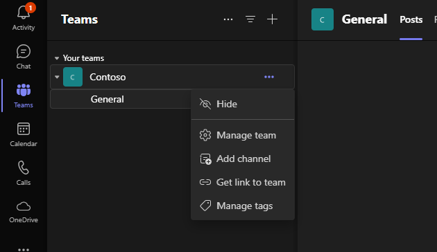

1. Create new channel to recieve status updates:<br>
    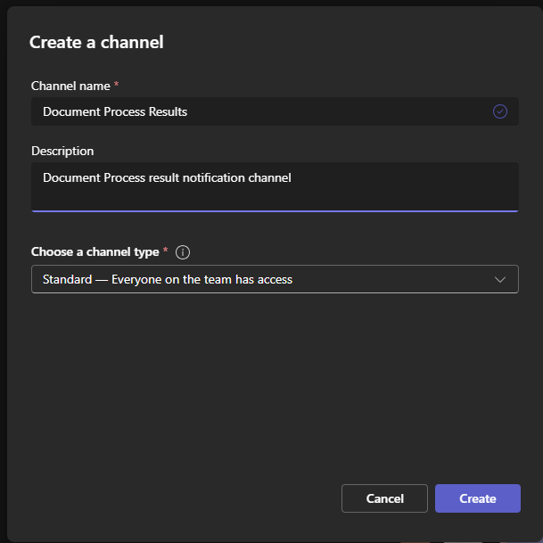


### Configure Teams API Connection
To access Teams from Logic Apps, we need to authorization a connection.

1. Click the deployed `teams` resource in Azure Portal:<br>
    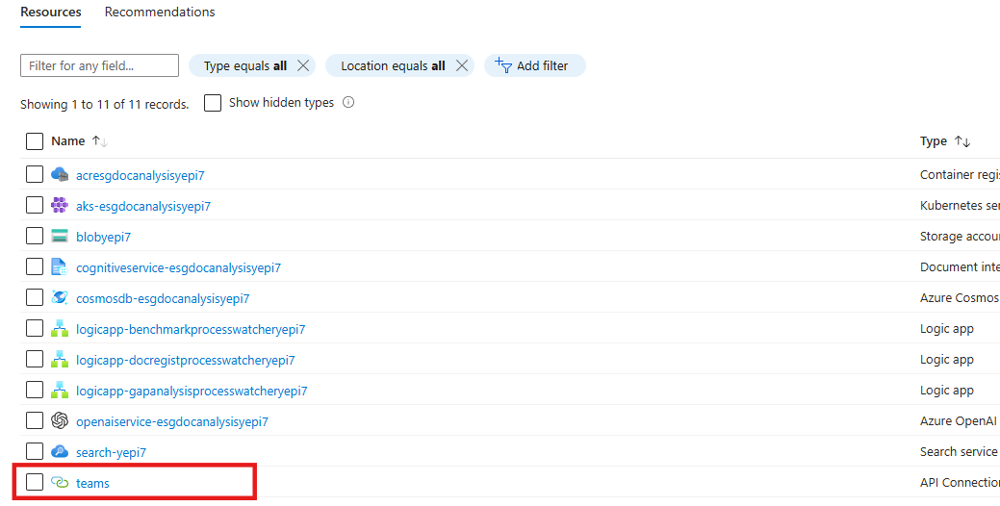

1. Click `Authorize` on the `General > Edit API connection` page:<br>
    

1. You will get a login flow to authorize connection:<br>
    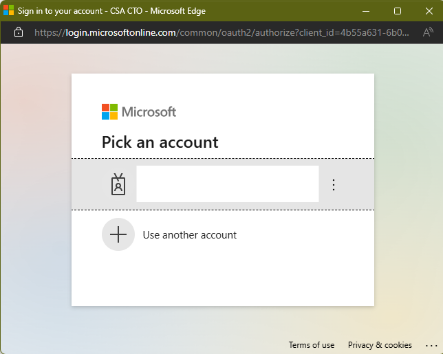

1. Once successfully logged in, click `Save` buton.


### Configure Logic App Actions
**Note: This step must be taken in all 3 deployed Logic Apps>**
* logicapp-benchmarkprocesswatcher{*}
* logicapp-docregistprocesswatcher{*}
* logicapp-gapanalysisprocesswatcher{*}

1. Within each Logic App, open the `Logic app designer`:<br>
    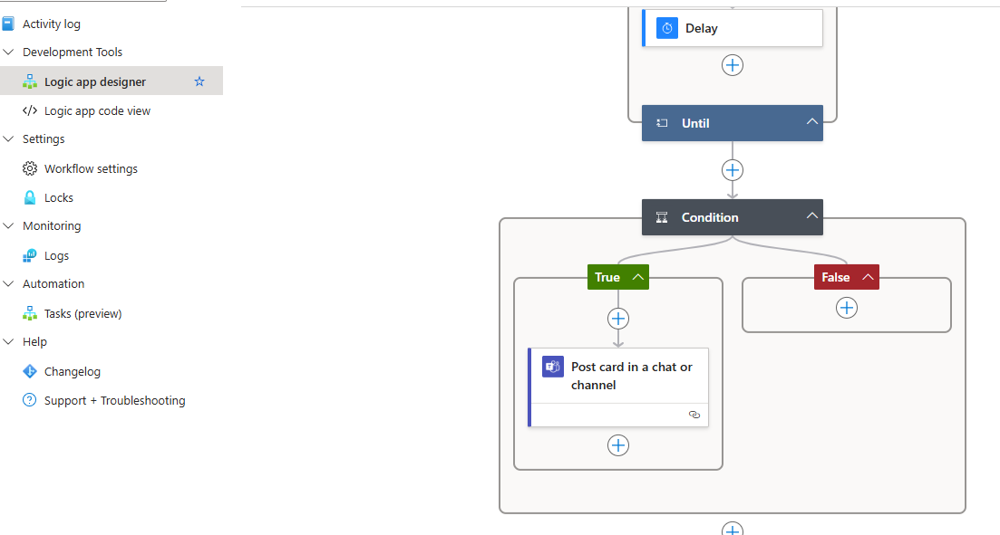

2. Select the Teams actions to update Channel information:<br><br>
    Set Team:<br>
    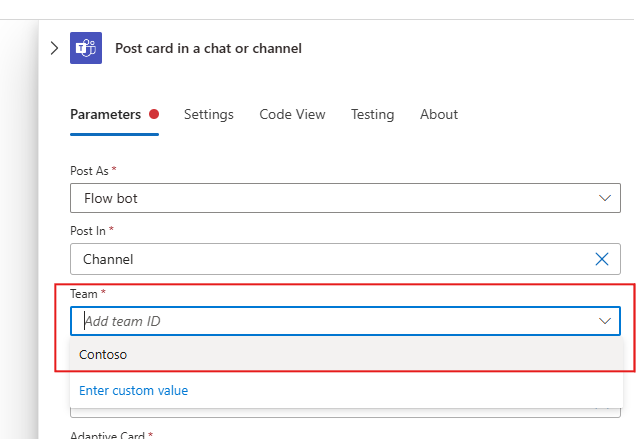<br>

    Set Channel:<br>
    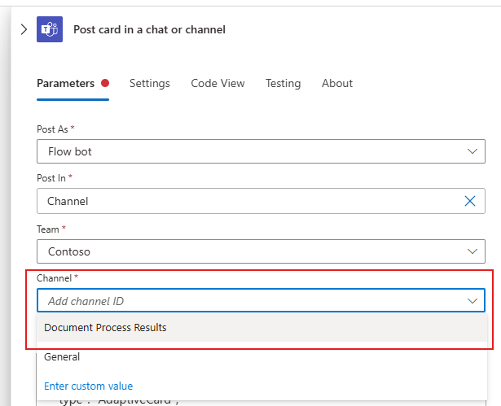


### Configure Logic App HTTP Call

1. Copy the `API Service Endpoint` from the deployment script summary:<br>
    
1. Open the Logic App named `logicapp-docregistprocesswatcher{*}`
1. Select and click `HTTP` action, which has the text `HTTP` next to a green logo. 
1. Paste URL replacing only `[...]` prefix and preserving API path:<br>
    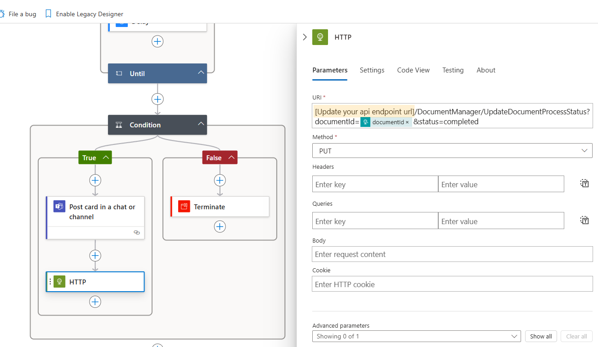<br>
    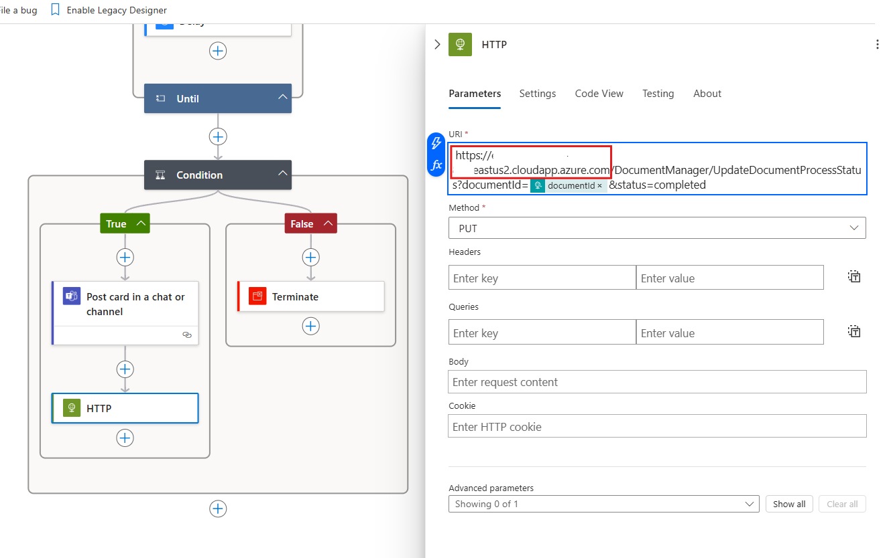


### Configure Azure OpenAI Rate Limits

> **Capacity Note:**
> * The deployment script creates models using the minimum tokens per minute (TPM) rate limit.
> * Faster performance can be achieved by increasing the TPM limit with Azure OpenAI Studio.
> * If capacity is too low, you may experience timeout errors.
> * Capacity varies for [regional quota limits](https://learn.microsoft.com/en-us/azure/ai-services/openai/quotas-limits#regional-quota-limits) as well as for [provisioned throughput](https://learn.microsoft.com/en-us/azure/ai-services/openai/concepts/provisioned-throughput).

1. Browse to Azure OpenAI Studio and select **each of the 3 models** within the `Deployments` menu:
    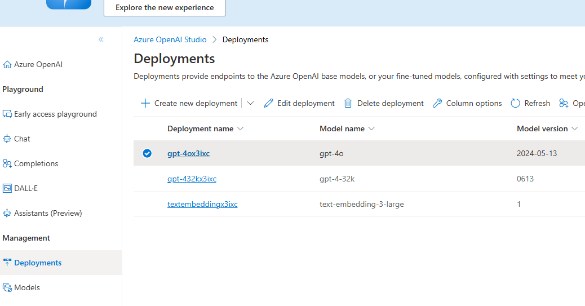  

1. Increase the TPM value for **each of the 3 models** for faster report generation:  
    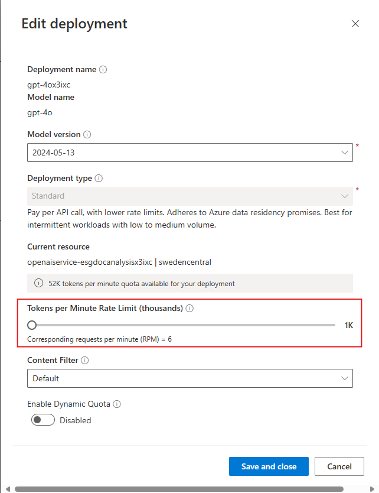

## Troubleshooting

If you experienced any issues during deployment, please review the [troubleshooting guide](./TROUBLESHOOTING.md).

## Next Steps

### 🥳🎉 First, congrats on finishing backend deployment!

* [Test backend APIs](./docs/TestApis.md)
* [Deploy Power Platform Client and set up Client integration with Services](./DeployPowerPlatformClient.md)

