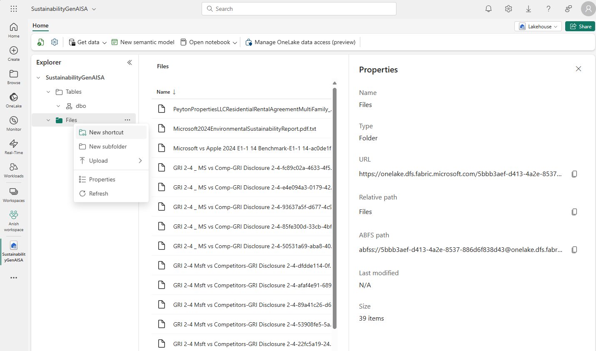
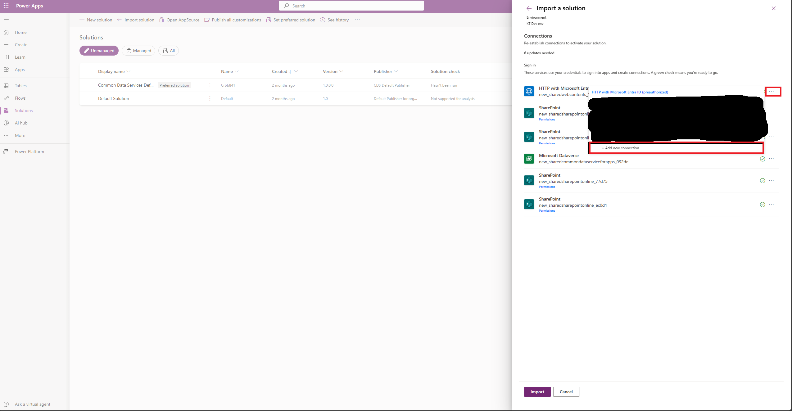
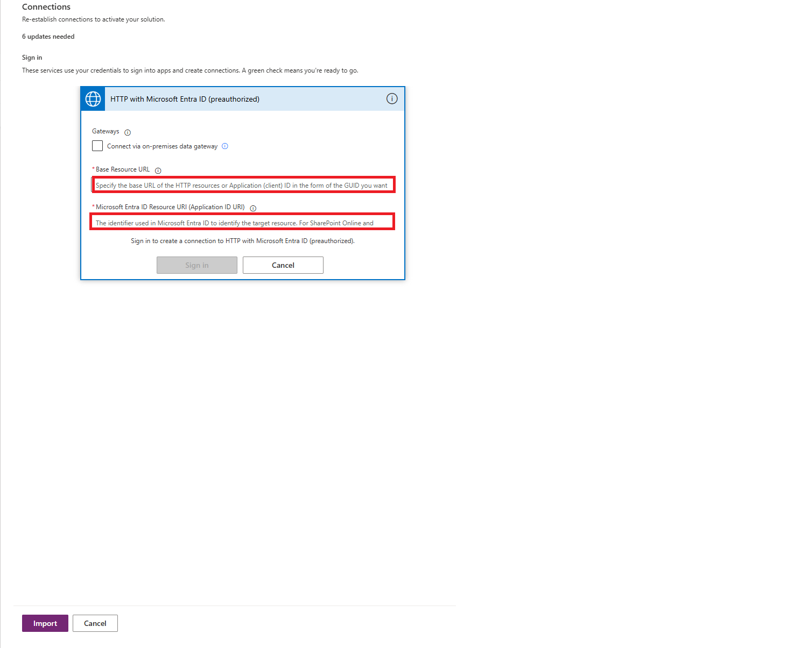
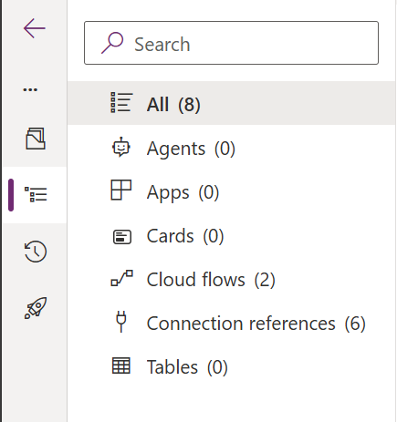
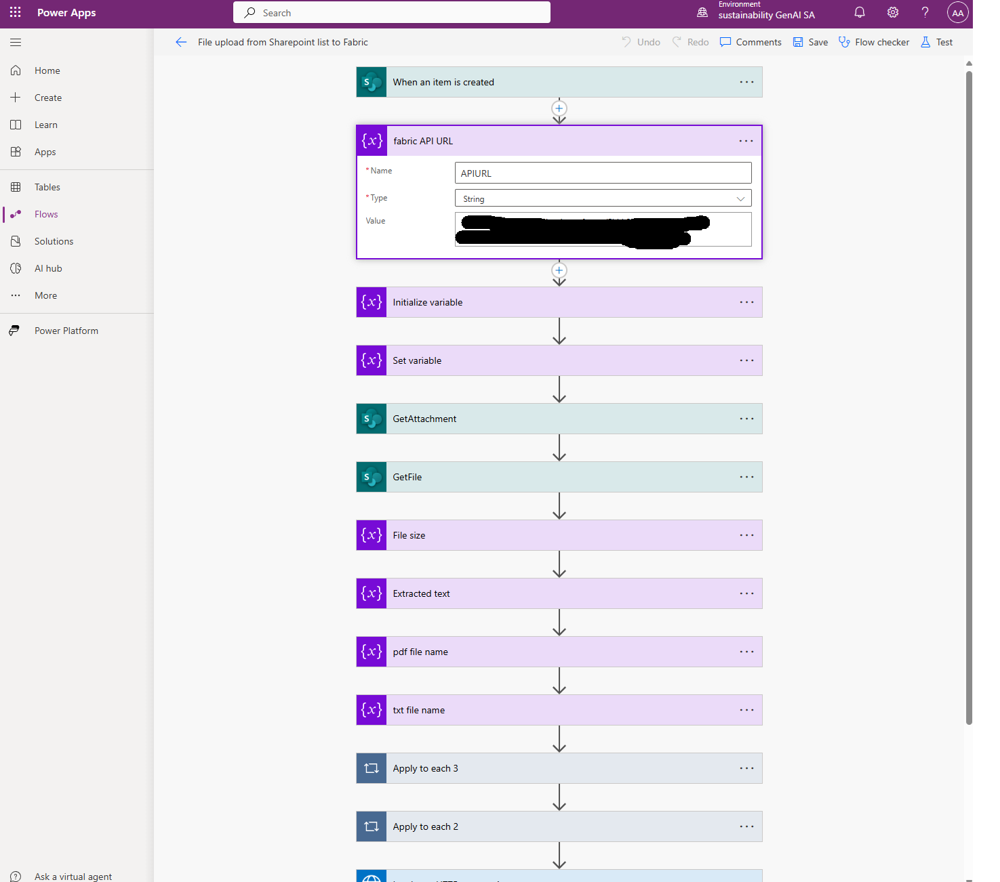

# Set up Fabric 

## Disclaimer

Fabric usage in this solution is **optional**. If you would like to use this accelerator without Fabric, please skip this section and make sure the 2 Power Automate workflows (Output doc upload from SharePoint to Fabric and File Upload from SharePoint List to Fabric) are switched off. 

## Pre Requisites	

1. Fabric License
2. Privileges to create a Fabric Workspace and a Lakehouse.
3. Power Platform Client readme has been completed and deployed.
4. Download [CompAnalysisFabricsolution.zip](../Client/CompAnalysisFabricsolution.zip) file from the `Client` folder of this accelerator.

## Step 1: Create Lakehouse

1. Go to https://app.fabric.microsoft.com/

2. Click on Data Engineering

3. In the left navigation menu, click on Workspaces.

4. Click 'New Workspace'

5. Give a name to the workspace and click Apply. All other fields are optional.

6. In your workspace, click 'New Item' from the top left.

7. Select Lakehouse and give a name to the Lakehouse. Click Create.

8. In the Lakehouse, right click on Files> Properties> Copy the URL. Save this URL which will be used in the next step.

   

   

## Step 2: Import Solution

Before setting up any flows of the fabric solution, we will need to import the solution in the Power Platform environment. 

1. In the PowerApps maker portal (make.powerapps.com), go to solutions > Import Solution > Browse > Choose CompAnalysisFabricSolution.zip > Next

2. Upon import, all required connections should automatically be established, if any connection is not established automatically, click on the 3 ellipsis and click 'Add new connection. You will probably need to do this for the HTTP with Microsoft Entra ID connector.

3. To do so, click on the 3 ellipsis> Add new connection

   

4. <u>You will need to enter the Base Resource URL which is the Fabric Lakehouse URL from Step 1.8 and Microsoft Entra Resource URI which for MS Fabric is: https://storage.azure.com.</u> Once both these values are entered> Click Sign In> Import.

   

5. This will import the Power Platform solution in your environment. To validate everything got deployed, go to the imported solution and the number of components should be the same as below.

   

## Step 3: Power Automate Flows Update

The fabric integration in this solution leverages 2 Power Automate workflows. The 1st flow (File Upload from SharePoint List to Fabric) is used to copy the Sustainability reports to Fabric from SharePoint and the 2nd flow (Output doc upload from SharePoint to Fabric) is used to copy the AI generated Benchmark or Gap Analysis Output doc to Fabric. In both Flows, we will need to update the Fabric API URL copied from Step 1.8 and the SharePoint URL.

1. Go to https://make.powerapps.com/ and make sure you are working on the correct environment from the top right created earlier from the DeployPowerPlatformClient readme.
2. Navigate to Flows from the menu on the right and click 'Edit' on the 'File Upload from Sharepoint List to Fabric' flow.
3. On the 3 SharePoint Steps of 'When an Item is created', 'GetAttachment' and 'GetFile',  select your Sharepoint Site from the dropdown. In the 'When an item is created' and 'GetAttachment' step, select the SharePoint List you created earlier which is used to upload sustainability reports. 
4. In the fabric API URL step, paste the URL that was copied from Step 1.8.
5. Click Save.
6. 
7. Make sure the flow is switched on.
8. Repeat steps 2, 4, 5 and 6 for the flow 'Output doc upload from SharePoint to Fabric'.
9. For the flow 'Output doc upload from SharePoint to Fabric', update the 3 SharePoint steps by selecting your SharePoint site and 'FabricOutputDocs' document library created earlier for the 'When a file is created' and 'Create txt file 2' step and only selecting the SharePoint site for the 'Get file content' step.
10. Click Save.

