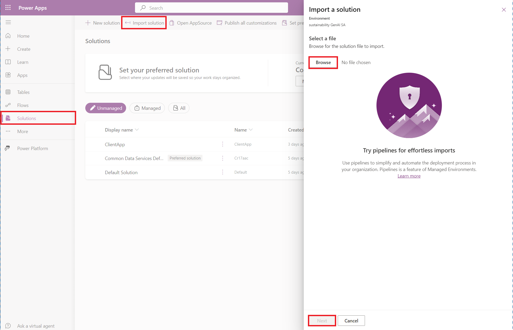
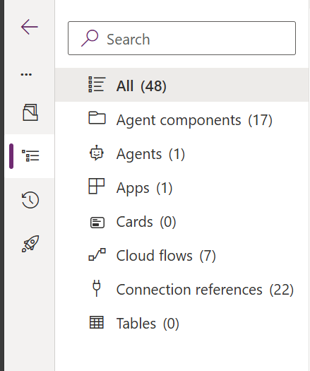
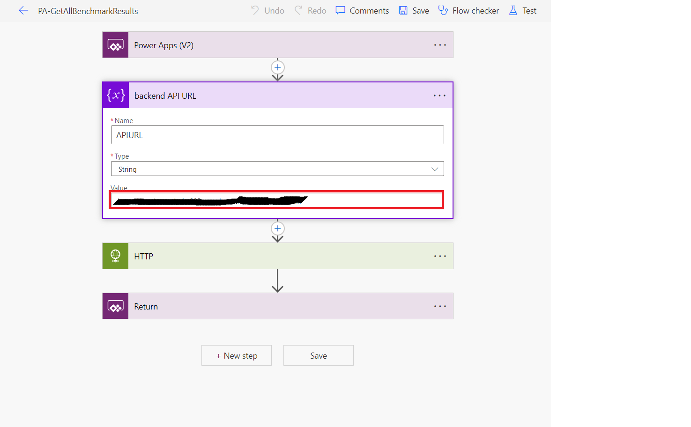
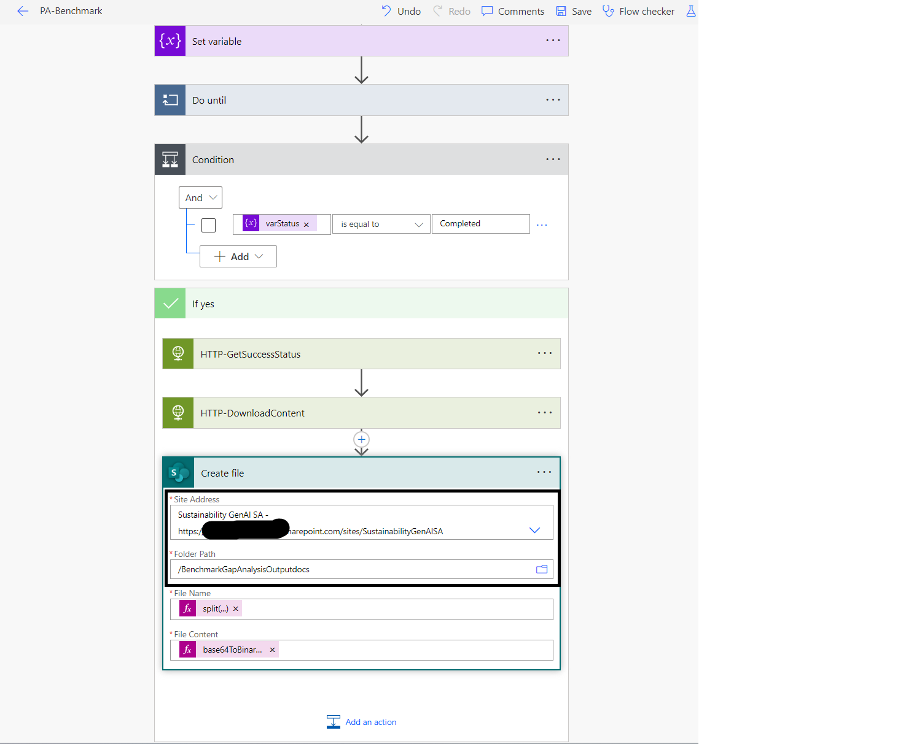
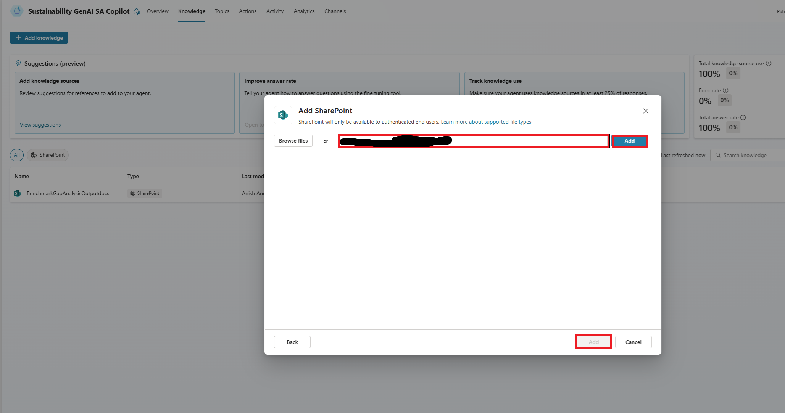
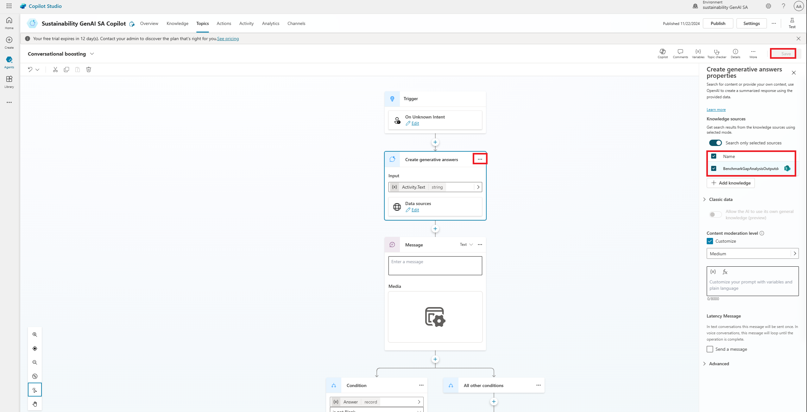
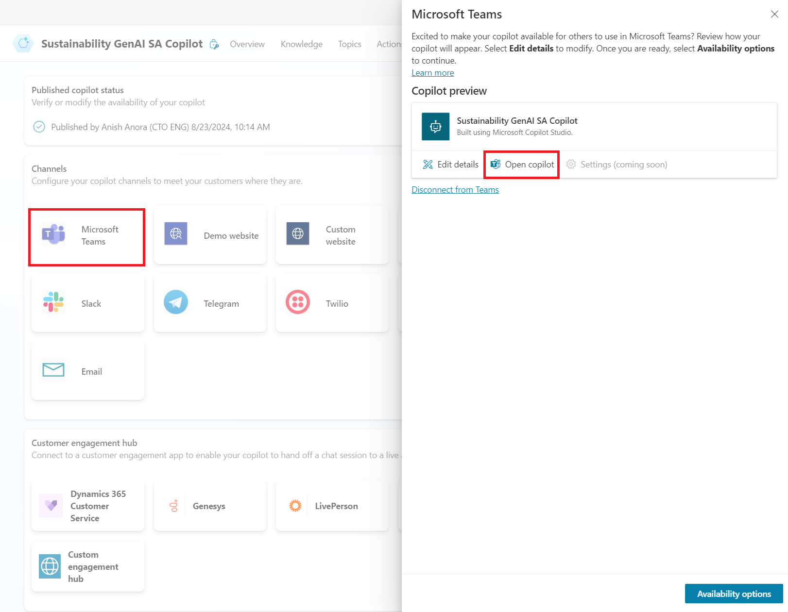
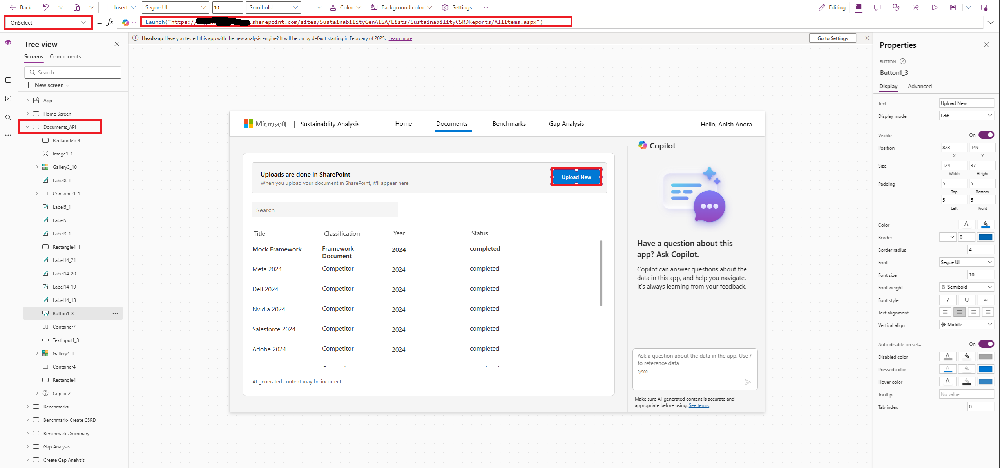

# Set up Client side
## Pre Requisites
1. Power Platform environment with System Administrator access.
2. PowerApps license.
3. Copilot Studio license.
4. AI Builder / AI Prompts access.
5. Privilege to grant admin consent for tenant in an Azure App Registration.
6. Access to create a SharePoint site.
7. Backend services of this accelerator must have been deployed already.
8. Download [PowerPlatformClient.zip](../Client/PowerPlatformClient.zip) file from the `Client` folder of this accelerator.
9. Download the 'Disclosure Detail' excel file from the `Client` folder of this accelerator.

## High level components that will be deployed from the Client solution.
This solution will include the below components whose setup will be covered step by step in the below sections-
1. GenAI Benchmarking and Gap Analysisv2 PowerApp.
2. Power Automate flows.
3. Custom Copilot.
4. SharePoint Site (the site will not be deployed from the solution but will be needed). More details in the section below.

### Step 1: Create SharePoint Site
This will be a completely manual step as the Power Platform solution does not include a SharePoint site. This site is needed to store documents from the frontend then send it to the backend & Fabric (if needed) for being leveraged to create Benchmarks & Gap Analysis reports.

1. Go to (https://(your tenant).sharepoint.com/) and click 'Create site'.
2. Select Team Site.
3. This SharePoint site will need SharePoint List (for storing sustainability reports), 2 SharePoint document repositories (for storing AI generated output reports and all documents that are sent to Fabric) and the out of the box Document library for storing an Excel file that comprises of metadata needed by the backend API depending on the selected disclosure during record creation.

#### Step 1.1: Out of the box document library
1. Upload the 'Disclosure Detail' excel file downloaded from the Client folder in the Document Library. 

#### Step 1.2: Create new Document Library
1. Create a new SharePoint document library (https://support.microsoft.com/en-us/office/create-a-document-library-in-sharepoint-306728fe-0325-4b28-b60d-f902e1d75939#ID0EBF=Modern) and name it 'BenchmarkGapAnalysisOutputdocs'.
2. This library will store all the output documents and will be used as a knowledge source from the Copilot. Please make sure the 'Disclosure details' excel file is NOT uploaded in this library.
3. <u>If you intend to use Fabric</u>, create another SharePoint document library and name it 'Fabricoutputdocs'.
4. This document library will store all Sustainability Reports and Output docs which will be sent over to a Fabric Lakehouse <u>(Fabric setup is covered in a subsequent readme).</u>

#### Step 1.3: Create new SharePoint List
1. Create a new SharePoint List (https://learn.microsoft.com/en-us/sharepoint/dev/business-apps/get-started/set-up-sharepoint-site-lists-libraries) and name it 'SustainabilityReports'.
2. In the SharePoint list, add a column for 'Title'(type of column: text), a column for 'Year' (type of column: text) and a choice type column for 'Classification'. The classification choices could be 'Your company name', Competitors etc. Basically all categories/types of Sustainability reports that will be uploaded.
3. It is important to avoid any spelling errors for these 3 columns as they are referenced in the Power Automate flows later. Feel free to add more columns as needed.
4. After the SharePoint components have been provisioned, it can take around 2 hours for them to show up in Power Automate.

## Step 2: Import Power Platform Solution
Before setting up any components of the solution, we will need to import the solution in the Power Platform environment. 
1. In the PowerApps maker portal (make.powerapps.com), go to solutions > Import Solution > Browse > Choose PowerPlatformClient.zip > Next

2. Upon import, all required connections should automatically be established, if any connection is not established automatically, click on the 3 ellipsis and click 'Add new connection'.
2. This will import the Power Platform solution in your environment. To validate everything got deployed, go to the imported solution and the number of components should be the same as below.

### Step 3: Update the Power Automate workflows
This solution leverages 9 Power Automate workflows. 7 are required for the core solution and the other 2 are optional to use if you plan to use Fabric as a part of this solution. The setup of the 2 flows used by Fabric (Output doc upload from SharePoint to Fabric & File upload from SharePoint list to Fabric) will be covered in the Fabric Readme. The setup of the other 7 flows is covered below.
Please make sure all 7 flows are turned on. If any of them are turned off, click on the 3 ellipsis next to their name> select 'Turn On'. 

The Power Automate workflows have 2 main components: backend API URL and SharePoint URL which need to be updated in all of them.

#### Step 3.1: Update Backend API URL
1. Open the PA-GetAllBenchmarkResults flow. 
2. Click Edit
3. Click on the 'backend API URL' step and paste the URL of the backend Azure services deployed already in the Value field.
4. Click Save.

5. Repeat steps 2-4 for following flows-
   PA-GetAllGapAnalysisResults
   Getalldocumentsfromapi
   File upload from Sharepoint list to API
   PA-GapAnalysis
   PA-Benchmark 

#### Step 3.2: Update SharePoint URL
1. Open the 'File upload from Sharepoint list to API' flow.
2. Click Edit
3. Update the 3 SharePoint actions with the SharePoint URL and the SharePoint list created earlier. You should be able to select the URL from the site address and List Name dropdown in the action.
4. Click Save from the top right

5. Open the 'output notification in Teams' flow.
6. Click Edit
7. Update the SharePoint action with the SharePoint URL and the Sharepoint list created earlier. You should be able to select the URL from the site address and Library Name dropdown in the action.
8. Click Save

9. Open the 'PA-Benchmark' flow.
10. Click Edit
12. Update the SharePoint action 'Create File' with the SharePoint URL and the SharePoint output document repository created earlier.
13. Click Save

14. Repeat steps 10-13 for 'PA-Gap Analysis' flow.

### Step 4: Update the Copilot Studio
#### Step 4.1: Update SharePoint URL as the knowledge source

1. Navigate to (https://web.powerva.microsoft.com/) and select your Power Platform environment which was used to deploy the client solution on the top right.
2. Navigate to the 'Knowledge' section in the Copilot Studio. If there are any existing knowledge sources that exist, delete them by clicking on the 3 dotted ellipsis > Delete.
3. Add a new knowledge source which will be used to leverage your SharePoint site as a source for the Copilot by clicking on 'Add Knowledge' > Click on SharePoint> click on the SharePoint > Enter your SharePoint site URL.
4. Click Save.

5. Go to 'Topics'> Conversational Boosting. In the topic, find the 'Create Generative answers' node and click on the ellipsis. Check your SharePoint knowledge source configured in steps 2-4 and click Save from the top right as per screenshot below.

#### Step 4.2: Configure Manual Authentication 
1. Manual authentication is required for the SharePoint site to be used as a knowledge source. Follow these steps (https://www.youtube.com/watch?v=rw4IwR68Wc0) from a video created by our Product Group of Copilot Studio.
2. Publish the Copilot by clicking the publish button.

#### Step 4.3: Configure Teams as a Channel
1. Go to Channels> Microsoft Teams> Turn On Teams
2. This will enable your copilot for Microsoft Teams and now the Copilot will be able to send notifcations & answer questions around the output documents.
3. Publish the Copilot by clicking the publish button.

### Step 5: Update the PowerApp
#### Step 5.1: Update the SharePoint URL in the Document Screen 

1. In the PowerApps maker portal (make.powerapps.com), go to Apps > GenAI Benchmarking and Gap Analysisv2 App 
2. In the 'Documents_API' screen, click on the 'Upload new' button
3. For the 'OnSelect' property of the button, update the URL to the SharePoint List created earlier. Only update the value inside the " ".

4. In the Benchmark-Create screen, for the Items property in the 2_1 gallery, update the Classification to your company value you selected in step 1.3. 
5. For gallery 2, update the Classification value if you configured something other than "Competitor" in step 1.3. If you configured "Competitor", then no action needed here.
6. Repeat Steps 4 for Gallery 2_2 in Create Gap Analysis screen.
7. This step is only needed if you get the below error when using the powerapp in the Create Benchmark or create Gap Analysis screen.

8. If you see this error, it is due to the excel file privileges. Please delete the excel file from the data section of the PowerApp and reupload the excel file from step 1.1 in the same SharePoint document repository.
9. Refresh your connection in the PowerApp as shown below.

10. Save the Power App and click publish from the top right.

